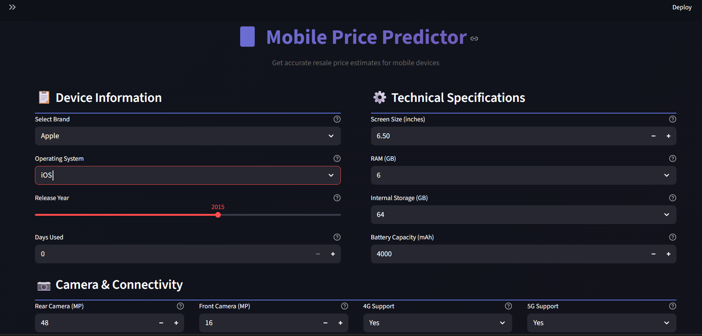
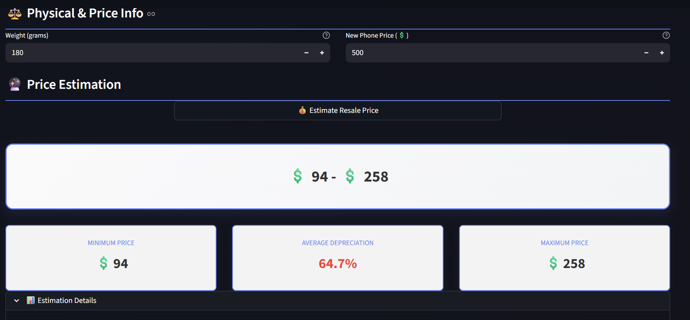

# 📱 Second-Hand Mobile & Tablet Price Prediction App

A machine learning–based web application that predicts the **resale price of second-hand mobile phones and tablets**. The app allows users to enter device details and instantly get a price prediction based on trained ML models.

---

## 🚀 Project Overview

This project combines **Data Science, Machine Learning** to build an end-to-end predictive system. It includes:

- Data preprocessing and model training using Python
- A saved ML model (`model.pkl`)
- A Streamlit-based web application for user interaction
- CSV datasets used for training and evaluation

This application can be useful for:
- Second-hand device sellers
- Online resale platforms
- Buyers wanting fair price estimates

---

## ✨ Features

- 📊 Data preprocessing and Exploratory Data Analysis (EDA)
- 🤖 Machine Learning model for price prediction
- 💾 Pre-trained model using Pickle
- 🧠 Easy-to-use interface

---

## 📁 Project Structure
- .vscode/
-  actual_prices.csv
-  ataset.csv
-  dodf.csv
-  main.ipynb
-  model.pkl
-  app.py
-  requirements.txt
-  README.md


### File Description

- **main.ipynb** – Data cleaning, EDA, feature engineering, model training, and evaluation  
- **model.pkl** – Trained machine learning model  
- **dataset.csv / actual_prices.csv / dodf.csv** – Datasets used for training and testing  
- **app.py** – Flask backend for serving predictions  
- **requirements.txt** – Required Python libraries  

---

## 🧠 Machine Learning Workflow

1. Load and clean the dataset  
2. Perform Exploratory Data Analysis (EDA)  
3. Feature selection and preprocessing  
4. Train a regression model  
5. Evaluate model performance  
6. Save trained model as `model.pkl`  
7. Use the model in a Flask web app  

---

## 🛠️ Technologies Used

- Python
- Pandas
- NumPy
- Scikit-learn
- Streamlit
- Pickle


---

## 🚀 How to Run the Project Locally

### 🔹 Step 1: Clone the Repository

```bash
git clone https://github.com/ChaliseRajesh19/Second-Hand-Mobile-Tablet-Prediction-App.git
cd Second-Hand-Mobile-Tablet-Prediction-App
```


### 🔹 Step 2: Install Dependencies

```bash
pip install -r requirements.txt
```

### 🔹 Step 3: Run the App

```bash
Streamlit run app.py
```

### 🔹Step 4: Open in Browser

## 🚀 **Streamlit App:**  
[https://](https://second-hand-mobile-tablet-prediction-app.onrender.com/)

## 📸 Screenshots







